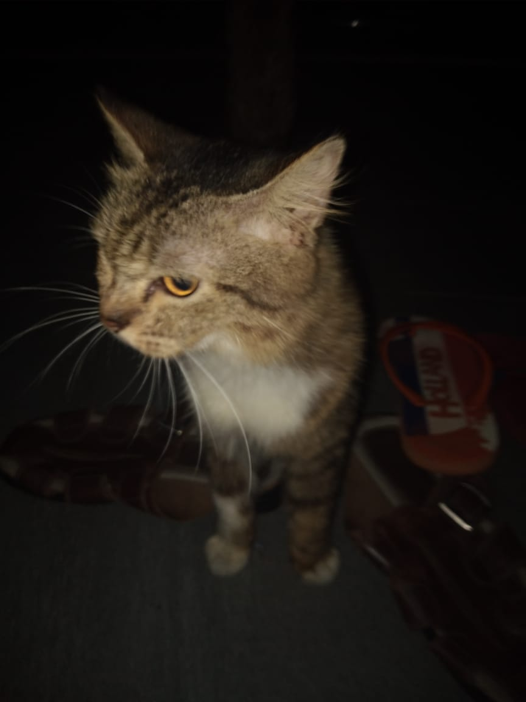
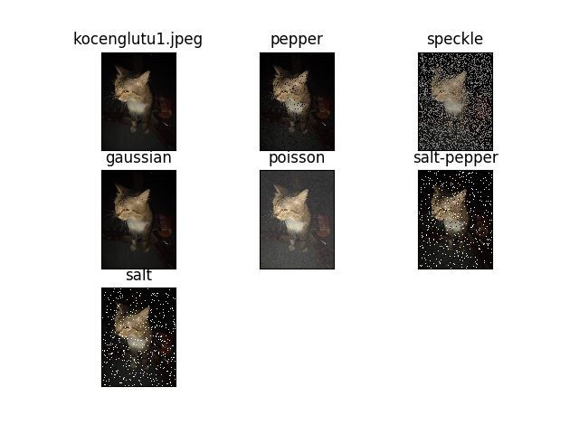
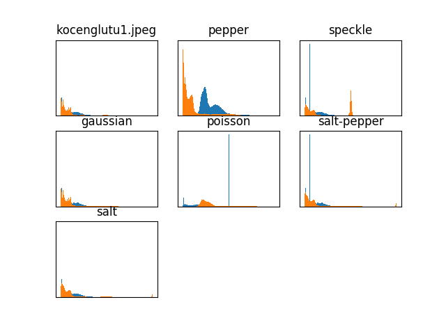
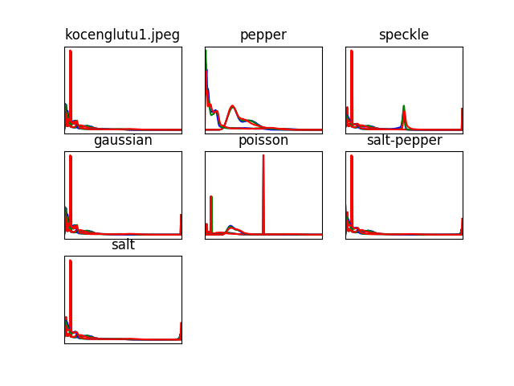

# Noise in Digital Image Processing
> Hafara Firdausi
> 05111950010040

## Description
* The goal of this first assignment is implementing any kind of image filtering method using Python, Matlab, or both of them.
* In this assignment, I choose to apply several kinds of noise in the image, implement mean and median filtering to denoise it, and then compare them to decide which one is better.

## Tools
* Python 3.7
* Jupyter notebook
* Some Python libraries:
  * Open-CV
  * Matplotlib
  * Numpy

## Implementation of Noise
1. Create and activate Python virtual environment
    ```bash
    $ virtualenv venv -p python3
    $ source venv/bin/activate
    ```
 
2. Run the script
    ```bash
    $ bash test.sh
    ```
    The script used to run several Python commands:
    ```bash
    #!/bin/bash

    # to add noises
    python3 add_noise.py
    # to display the result (noised image)
    python3 display.py img
    # to display the histogram
    python3 display.py hist gray
    python3 display.py hist rgb
    ```
    At first, I tried to detect type of noise by the histogram, but not yet realized.

3. List of implemented noises:
    * **Gaussian Noise**
        ```python
        def apply_gaussian(img):
            output = cv2.GaussianBlur(img, (5,5), 0)
            return output
        ```

    * **Salt-Pepper Noise** (Salt, Pepper, Salt-Pepper)
        ```python
        def apply_salt_pepper(img, is_salt=True, is_pepper=True, prob=0.05):
            output = np.zeros(img.shape, np.uint8)
            thres = 1 - prob
            for i in range(img.shape[0]):
                for j in range(img.shape[1]):
                    rand = random.random()
                    if rand < prob:
                        output[i][j] = 0 if is_pepper else img[i][j]
                    elif rand > thres:
                        output[i][j] = 255 if is_salt else img[i][j]
                    else:
                        output[i][j] = img[i][j]
            return output
        ```

    * **Poisson Noise**
        ```python
        def apply_poisson(img):
            noise = np.random.poisson(50, img.shape)
            output = img + noise
            return output
        ```

    * **Speckle Noise**
        ```python
        def apply_speckle(img, prob=0.07):
            output = np.zeros(img.shape, np.uint8)
            thres = 1 - prob
            for i in range(img.shape[0]):
                for j in range(img.shape[1]):
                    rand = random.random()
                    if rand < prob:
                        output[i][j] = 128
                        for k in range(5):
                            output[i-k][j-k] = 128 + 10*rand
                    else:
                        output[i][j] = img[i][j]
            return output
        ```
    The complete script can be found [here](add_noise.py).

## Result
1. Original image
   
    

2. Noised images

    

3. Histogram of noised images
    * Grayscale
  
        

    * RGB

        

## Implementation of Filtering for Denoising Image
* [Mean Filter](mean_filter.ipynb)
* [Median Filter](median_filter.ipynb)

## References
* [Noise in Digital Image Processing](https://medium.com/image-vision/noise-in-digital-image-processing-55357c9fab71)

